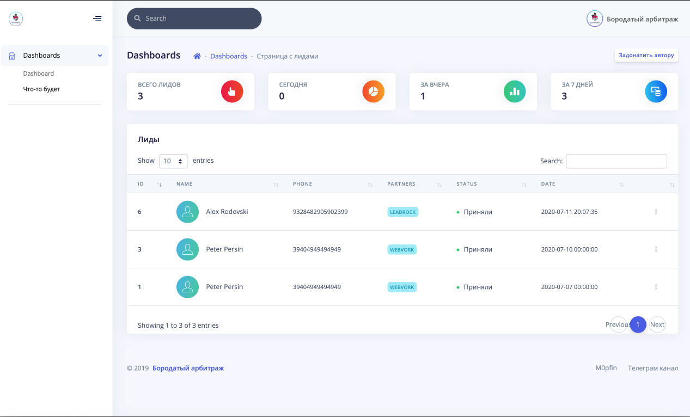

**Скрипт для сохранения лидов на стороне вебмастера**

- Установка: 

1. Распаковывем архив на сервер/хостинг
2. В файле `include/config.php` прописать данные к вашей базе данных
3. В файле `order.php` вписать ваш токен и ID оффера - Webvork
4. В файле `order.php` в `$url = 'https://ВАШ_САЙТ.РУ/lead/handler.php';` вписать адрес куда установили скрипт

Внедрение формы в проклу: 

- Заходим в кейтаро открываем проклу (ВАЖНО!!! Имя index.html - проклы заменить на index.php)
- Открываем любым редактором кода
- В нужное вам место вставляем следующую строку: 

`<iframe src="apiform.php?utm_medium=<?=$_GET['utm_medium'];?>&country=<?=$_GET['country'];?>&offer_id=<?=$_GET['offer_id'];?>&partners=webvork&color=ff6e4a" width="550" height="320" scrolling="no" frameborder="0"></iframe>`

Чтобы сделать по центру заключаем код в теги `
` между ними код `
`

и получаете встроенную форму в вашей прокле

Разбираем пошагово: 

`utm_medium=<?=$_GET['utm_medium'];?> `- забирает метку `utm_medium` из ссылки

`country=<?=$_GET['country'];?>` - забирает метку `country` из ссылки

`offer_id=<?=$_GET['offer_id'];?>` - забирает метку `offer_id` из ссылки

`partners=webvork` - пишем любое название ПП `partners` (партнерка) её будет отображаться в скрипте с лидами

`color=ff6e4a` - цвет формы (гуглить "яндекс палитра")

`width="550" height="320" `- ширина и высота формы заказа

